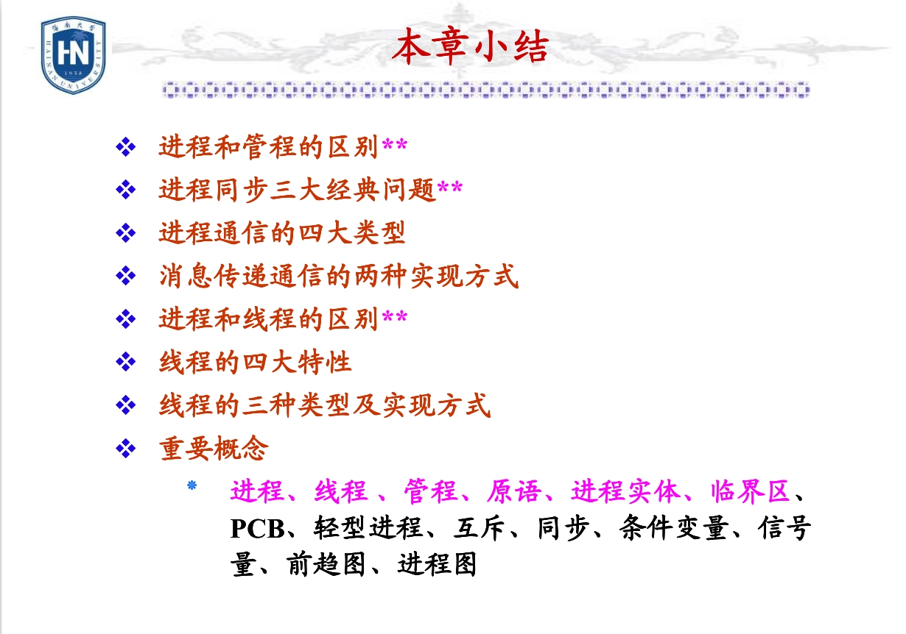

# 操作系统复习

* 判断题 - 10 × 1’
* 选择题 - 20 × 2‘
* 填空题 - 10（每道两空） × 0.5‘
* 大题 - 5 × 8’

## [张春元独家 PPT](./OSppt)

## 选择、填空

都是ppt本章小结里的加 * 的，主要是书上的小标题

可能会考的点：操作系统的基本特性、作业调度2种类型、程序的装入和链接、IO系统模型分层、逻辑结构的几种类型、文件目录的4个目标、外存的几种组织方式、用户接口的几类、操作系统接口2种类型

## 大题分布（没有考概念的简答题）

* 第二章 - 一道
* 第三章 - 一道
* 第四五章 - 一道
* 第六章 - 一道
* 第七八章 - 一道

## 必考题类型

第六章ppt中的补充题1

## 第一章

* OS 定义：OS 是管理和控制计算机软硬件资源、合理进行作业调度和方便用户使用的程序集合
* OS 的目标：**有效性**、**方便性**、可扩充性、开放性
* OS 三大作用
  * 作为用户和计算机硬件的接口
  * 对计算机软硬件资源进行管理
  * 对计算机软硬件资源进行抽象 
* OS 5 大发展动力
  * 为了提高计算机资源利用率
  * 方便用户使用
  * 硬件的跟新换代
  * 计算机体系架构的发展
  * 不断提出的新的应用需求
* OS 三大基本类型：**多道批处理系统、分时系统、实时系统**

单道批处理系统：单道性、顺序性、自动性

多道批处理系统：多道性、无序性、调度性

分时系统：多路性（同时性）、独立性、及时性、交互性

* OS 的四大特性：**并发性**、**共享性**、虚拟技术、异步性
> 并发和共享是操作系统最基本的特性

* 进程是资源分配和调度的基本单位；线程是独立运行、调度和分配的基本单位
* 资源共享的两种方式：互斥共享（又称临界资源后独占资源）、同时访问
> 判断是：一段时间内只允许一个还是可以多个 “同时” 访问某资源
* OS 中的两种虚拟技术：时分复用、空分复用
* 微内核 OS 结构：
  * 基于客户机 / 服务器模式
  * 有足够小的内核
  * 应用 ”机制和策略分离“ 的原理
  * 采用面向对象技术
  
  ## 第二章

* 程序顺序执行的特征：顺序性、封闭性、可再现性
* 程序并发执行的特征：间断性、失去封闭性、不可再现性
> 并发执行失去封闭性是因为：共享资源的影响
> 并发执行不可再现性是因为：对临界资源没有互斥访问
* 进程实体 = 程序段 + 数据段 + 进程控制块（ PCB ）
* 进程的特征：动态性、并发性、独立性、异步性
* PCB 是 OS 感知进程存在的唯一标志；进程和 PCB 是一一对应的；PCB 常驻内存
> 作业调度是将程序从外存调入内存，分配资源，建立进程，调度完成后处于就绪态
* 一个信号量代表一类共享资源的可用数量
> 进程调度是处理如何将处理机分配给处于就绪态的进程
* 管程与进程比较
1. 设置目的不同:设置目的不同:设置进程是为了实现系统的并发性；设置管程则是解决共享资源的互斥与同步
2. 数据结构不同:数据结构不同:管程定义的是公用数据结构；而进程定义的是私有数据结构
3. 数据结构上的操作不同:进程是由顺序程序执行有关操作；管程主要进行同步操作和初始化操作
4. 工作方式不同:管程被进程调用，为被动工作方式；进程则为主动工作方式
5. 并发不同：管程和调用它的进程不能并发工作；而进程之间能并发工作，并发性是其固有特性
6. 生命周期不同:管程是操作系统的固有成分，无创建和撤消；而进程有生命周期，由创建而产生、由撤销而消亡

* 消息传递通信的两种实现方式：直接通信方式、间接通信方式
* 高级进程通信四大类型：共享存储器系统、管道通信系统、消息传递系统、客户机 - 服务器系统

